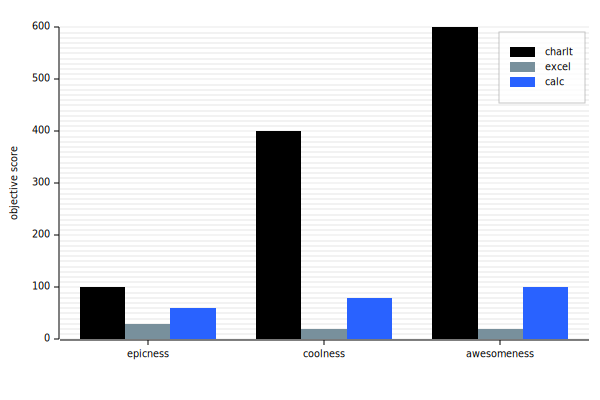
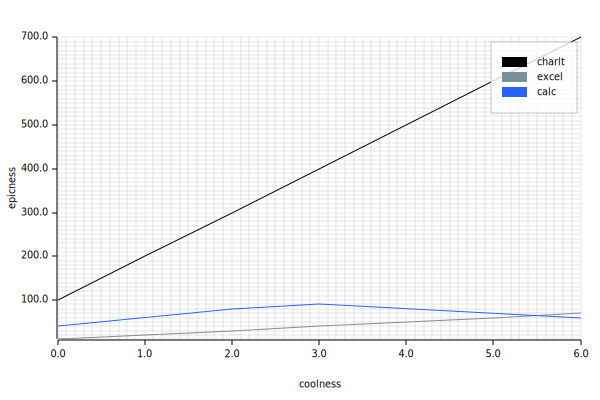

# charlt

_Generate charts from spec files_.

You've got all your data collected, and now you want to make some charts. So
you take your table to excel and you make some charts, awesome. Now what? You
want to put it in your paper or upload it to your blog or whatever, so you
export as an image. However, you want to keep the original data around so you
can easily update the chart later, but this is a binary file format that can
only be read by a specific program. Humans can't read that, and nor can git.

Enter stage left: charlt. Charlt lets you write chart "specs" in text formats (e.g. yaml). It also has lua support for more complex scripts in case
you were missing excels math functions already.

## Features

- Supports multiple input formats, theoretically anything supported by
  [serde](https://serde.rs/) could be supported. Currently supported:
  - yaml
  - lua
- Support for multiple output formats via
  [plotters](https://docs.rs/plotters/latest/plotters/index.html). Currently
  supported:
  - png
  - svg
  - pdf
- Charts!!
  - bar
  - xy scatter
- Input format is designed to be human readable and git friendly

## Charts

There is a base schema for all chart types:

```ts
interface Dataset<Pt> {
  name: string // name of the dataset, for legend
  colour: string // css colour value, also aliased to 'color' for the americans
  values: []Pt
}
interface XY<T> {
  x: T
  y: T
}
interface Chart<Pt> {
  // font for various text on the chart
  font?: {
    family: string // family
    size: number // pt size
  }
  margins?: XY<number?> // margins for chart
  caption?: string // caption for top of chart
  datasets: []Dataset<Pt>

}
```

### Bar

The bar chart dataset format has values corresponding to each category. The categories
are defined by the top-level value `categories`

```ts
type Bar = Chart<number>
```

examples:



### XY-Scatter

```ts
type XYScatter = Chart<XY<number>>
```

examples:



